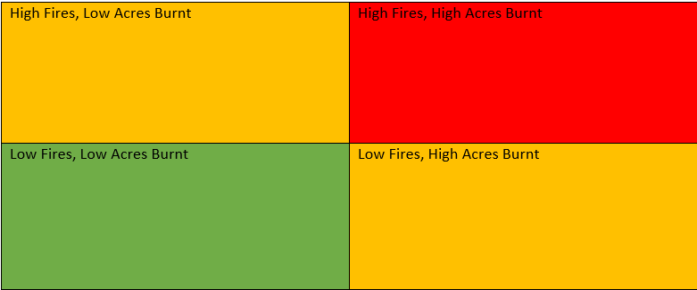

```{r setup, include=FALSE}
knitr::opts_chunk$set(echo = TRUE)
```

## Source
Main data sources were from https://www.iii.org/table-archive/23284 and https://www.nifc.gov/fire-information/statistics/wildfires. Both the insurance
information institute and national interagency fire center are trustable sources
and have a vested interest in preventing wildfires and wildfire damage.

## Datasets
Using the sources above two primary datasets were created.TotalWildfiresAndAcres,
which compiles # of fires and # of acres burned from 1983 - 2022 and USA state 
wildfires which stratifies these metrics by individual states, from 2010-2021.It
should be noted that the year 2012 is not present in the USA state wildfires
dataset because it was not present in the iii archive.

We can begin our analysis by examining the relationship between number of fires
and number of acres:

```{r}
library(readxl)
library(ggplot2)
TotalWildfiresAndAcres <- read_excel(path = "C:/ram/pro/TAMU/2023DataCompetition/TotalWildfiresAndAcres.xlsx")
USAStateWildfires <- read_excel(path = "C:/ram/pro/TAMU/2023DataCompetition/USAStateWildfires.xlsx")
summary(TotalWildfiresAndAcres)
TotalWildfiresAndAcres
dim(TotalWildfiresAndAcres)
summary(USAStateWildfires)
USAStateWildfires
dim(USAStateWildfires)
```


## Starting Plots
From this data we can start with some plots:

```{r,echo=FALSE}
ggplot(TotalWildfiresAndAcres, aes(Year, Fires)) + geom_line()
ggplot(TotalWildfiresAndAcres, aes(Year, Acres)) + geom_line()
ggplot(TotalWildfiresAndAcres, aes(Fires, Acres)) + geom_point()
```

From the plots we can see that in general over time more acres are being burned.
The relationship between fires and years however is less obvious.
We can also see that the scatterplot between fires and acres yields some interesting
discoveries. In general low fire years lead to low acre burns however high fire 
years do not necessarily correlate to high acre burns. Fitting trend lines to 
these plots will help us analyze further and forecast future numbers.

## Forecasting Plots
Tableau dashboards will be used for added interactivity, and as well for the
impressive analytics tools and animation capability built in to the platform. 

<div class='tableauPlaceholder' id='viz1677698077494' style='position: relative'>
<noscript>
<a href='#'>
</a></noscript><object class='tableauViz'  style='display:none;'><param name='host_url' value='https%3A%2F%2Fpublic.tableau.com%2F' /> <param name='embed_code_version' value='3' /> <param name='site_root' value='' /><param name='name' value='Fire_16776980457310&#47;FireAcreForecasts' /><param name='tabs' value='no' /><param name='toolbar' value='yes' /><param name='static_image' value='https:&#47;&#47;public.tableau.com&#47;static&#47;images&#47;Fi&#47;Fire_16776980457310&#47;FireAcreForecasts&#47;1.png' /> <param name='animate_transition' value='yes' /><param name='display_static_image' value='yes' /><param name='display_spinner' value='yes' /><param name='display_overlay' value='yes' /><param name='display_count' value='yes' /><param name='language' value='en-US' /></object></div>                


```{js,embedcode,echo=FALSE}
var divElement = document.getElementById('viz1677698077494');                    
var vizElement = divElement.getElementsByTagName('object')[0];                    
if ( divElement.offsetWidth > 800 ) { vizElement.style.width='1000px';vizElement.style.height='827px';} else if ( divElement.offsetWidth > 500 ) { vizElement.style.width='1000px';vizElement.style.height='827px';} else { vizElement.style.width='100%';vizElement.style.height='727px';}                     
var scriptElement = document.createElement('script');                    
scriptElement.src = 'https://public.tableau.com/javascripts/api/viz_v1.js';                    vizElement.parentNode.insertBefore(scriptElement, vizElement);                
```

The Visualization above has a filter so you can examine a group of years closer. 
It also shows clouds of forecasts for fires and acres in the next 2-5 years.
Use mouse to hover to see numbers and use mouse to adjust slider.
Trend lines and forecasts will change based on what years are chosen in the slider.

Now that we have a better idea of fire and acre numbers as a whole, let us see
how we can granularize this data by state.
States can be broken into fire regions based on, 
https://www.worldatlas.com/articles/the-officially-recognized-four-regions-and-nine-divisions-of-the-united-states.html

## USA State Fire Animation
First let us see an animation of Number of Fires Across the Years over different
states. 

<div class='tableauPlaceholder' id='viz1677700982567' style='position: relative'><noscript><a href='#'></a></noscript><object class='tableauViz'  style='display:none;'><param name='host_url' value='https%3A%2F%2Fpublic.tableau.com%2F' /> <param name='embed_code_version' value='3' /> <param name='site_root' value='' /><param name='name' value='Fire_16776980457310&#47;Dashboard2' /><param name='tabs' value='no' /><param name='toolbar' value='yes' /><param name='static_image' value='https:&#47;&#47;public.tableau.com&#47;static&#47;images&#47;Fi&#47;Fire_16776980457310&#47;Dashboard2&#47;1.png' /> <param name='animate_transition' value='yes' /><param name='display_static_image' value='yes' /><param name='display_spinner' value='yes' /><param name='display_overlay' value='yes' /><param name='display_count' value='yes' /><param name='language' value='en-US' /><param name='filter' value='publish=yes' /></object></div>                


```{js,embedcode2,echo=FALSE}                   
var divElement = document.getElementById('viz1677700982567');                    
var vizElement = divElement.getElementsByTagName('object')[0];                    
if ( divElement.offsetWidth > 800 ) { vizElement.style.width='1000px';vizElement.style.height='827px';} else if ( divElement.offsetWidth > 500 ) { vizElement.style.width='1000px';vizElement.style.height='827px';} else { vizElement.style.width='100%';vizElement.style.height='727px';}                     
var scriptElement = document.createElement('script');                    scriptElement.src = 'https://public.tableau.com/javascripts/api/viz_v1.js';                    vizElement.parentNode.insertBefore(scriptElement, vizElement);                
```
From this animation we can draw some interesting conclusions. Namely we see that
there are quite a considerable amount of fires in Texas and in southeastern states.
We also see that California has a high number of fires, although this is not 
consistent throughout the years.
For the viz above a filter is available to focus on a specific state, one can pan
around the map with shift+Left click. It is also possible to play the animation
forward and backward with the bar at the top-middle.YOu can also hover over a 
state to see the exact number of fires plus state name. A user can scroll with the
mouse wheel to zoom in and out.

With this initial animation it would be useful to see which regions require the 
most focus in term of forest fire help. A first glance tells us that the west 
and south of the country are problem areas.
We can look at a racing bar chart to examine this criteria and confirm our hypothesis.

## US Fires Bar Race

<div class='tableauPlaceholder' id='viz1677703052671' style='position: relative'><noscript><a href='#'></a></noscript><object class='tableauViz'  style='display:none;'><param name='host_url' value='https%3A%2F%2Fpublic.tableau.com%2F' /> <param name='embed_code_version' value='3' /> <param name='site_root' value='' /><param name='name' value='Fire_16776980457310&#47;Dashboard4' /><param name='tabs' value='no' /><param name='toolbar' value='yes' /><param name='static_image' value='https:&#47;&#47;public.tableau.com&#47;static&#47;images&#47;Fi&#47;Fire_16776980457310&#47;Dashboard4&#47;1.png' /> <param name='animate_transition' value='yes' /><param name='display_static_image' value='yes' /><param name='display_spinner' value='yes' /><param name='display_overlay' value='yes' /><param name='display_count' value='yes' /><param name='language' value='en-US' /><param name='filter' value='publish=yes' /></object></div>                

```{js,embedcode3,echo=FALSE}                  
var divElement = document.getElementById('viz1677703052671');                    
var vizElement = divElement.getElementsByTagName('object')[0];                    
if ( divElement.offsetWidth > 800 ) { vizElement.style.width='1000px';vizElement.style.height='827px';} else if ( divElement.offsetWidth > 500 ) { vizElement.style.width='1000px';vizElement.style.height='827px';} else { vizElement.style.width='100%';vizElement.style.height='727px';}                     
var scriptElement = document.createElement('script');                    scriptElement.src = 'https://public.tableau.com/javascripts/api/viz_v1.js';                    vizElement.parentNode.insertBefore(scriptElement, vizElement);                
```

Focusing on the top 10 states/bars we can very clearly see that the majority of
these high-fire states belong to the south and west regions, thus confirming our
hypothesis. 

With this in mind, it is important to now analyze how many acres were burned 
through each state. This is important because this metric is a showcase of 
fire-fighting effectiveness of a state. If a state has a large number of fires but
a low number of acres burned this can be attributed to an effective fire-fighting
force and response system.

## US Acres Burned Animation

<div class='tableauPlaceholder' id='viz1677704140402' style='position: relative'><noscript><a href='#'></a></noscript><object class='tableauViz'  style='display:none;'><param name='host_url' value='https%3A%2F%2Fpublic.tableau.com%2F' /> <param name='embed_code_version' value='3' /> <param name='site_root' value='' /><param name='name' value='Fire_16776980457310&#47;Dashboard3' /><param name='tabs' value='no' /><param name='toolbar' value='yes' /><param name='static_image' value='https:&#47;&#47;public.tableau.com&#47;static&#47;images&#47;Fi&#47;Fire_16776980457310&#47;Dashboard3&#47;1.png' /> <param name='animate_transition' value='yes' /><param name='display_static_image' value='yes' /><param name='display_spinner' value='yes' /><param name='display_overlay' value='yes' /><param name='display_count' value='yes' /><param name='language' value='en-US' /><param name='filter' value='publish=yes' /></object></div>                

```{js,embedcode4,echo=FALSE}                     
var divElement = document.getElementById('viz1677704140402');                    
var vizElement = divElement.getElementsByTagName('object')[0];                    
if ( divElement.offsetWidth > 800 ) { vizElement.style.width='1000px';vizElement.style.height='827px';} else if ( divElement.offsetWidth > 500 ) { vizElement.style.width='1000px';vizElement.style.height='827px';} else { vizElement.style.width='100%';vizElement.style.height='727px';}                     
var scriptElement = document.createElement('script');                    
scriptElement.src = 'https://public.tableau.com/javascripts/api/viz_v1.js';                    vizElement.parentNode.insertBefore(scriptElement, vizElement);                
```

From this animation, we can see that the size of the state can have an influence on acres burned.For example, Alaska is a huge state and as a result is often at the top in terms of acres burned. Whether this is because Alaska is simply not prepared for forest fires, or has no need to fight them because of the harsh landscape and low population density of the state is a different story. We can also see that number of fires doesn't always mean more acres burned, as a number of states with high amount of fires were often low on the acres burned scale.

Having now seen the what constitutes fire amounts and acres burned. Is there a way we can predict where a state will end up relative to past fire season performance? Hopefully the next visualization will provide a unique insight into averages of these metrics and what can be expected.

## FiresVSAcres Bubble Animation
From our data we can find the average number of fires and the average number of acres burned over the roughly 10 year rime span. Plotting these averages over the years and comparing with state fire metrics yields interesting results.

<div class='tableauPlaceholder' id='viz1677706986110' style='position: relative'><noscript><a href='#'></a></noscript><object class='tableauViz'  style='display:none;'><param name='host_url' value='https%3A%2F%2Fpublic.tableau.com%2F' /> <param name='embed_code_version' value='3' /> <param name='site_root' value='' /><param name='name' value='Fire_16776980457310&#47;Dashboard5' /><param name='tabs' value='no' /><param name='toolbar' value='yes' /><param name='static_image' value='https:&#47;&#47;public.tableau.com&#47;static&#47;images&#47;Fi&#47;Fire_16776980457310&#47;Dashboard5&#47;1.png' /> <param name='animate_transition' value='yes' /><param name='display_static_image' value='yes' /><param name='display_spinner' value='yes' /><param name='display_overlay' value='yes' /><param name='display_count' value='yes' /><param name='language' value='en-US' /><param name='filter' value='publish=yes' /></object></div>                

```{js,embedcode5,echo=FALSE}                     
var divElement = document.getElementById('viz1677706986110');                    
var vizElement = divElement.getElementsByTagName('object')[0];                    
if ( divElement.offsetWidth > 800 ) { vizElement.style.width='1000px';vizElement.style.height='827px';} else if ( divElement.offsetWidth > 500 ) { vizElement.style.width='1000px';vizElement.style.height='827px';} else { vizElement.style.width='100%';vizElement.style.height='727px';}                     var scriptElement = document.createElement('script');                    scriptElement.src = 'https://public.tableau.com/javascripts/api/viz_v1.js';                    vizElement.parentNode.insertBefore(scriptElement, vizElement);                
```

The purple lines are the average lines for acres burned and number of fires.It is important to note that the scales on each axis are different. Fires go up to 10,000+ while acres goes up to 6 million+. The overall average lines did change throughout the years however it was evident that the intersection of the lines was relatively consistent landing between 1000 - 1500 fires and 60,000 to 205,000 acres burned. These guidelines give us a good grid guideline that can be used to allocate resources better.

An example of this is as follows:

```{r,echo=FALSE}

```

Here Red would be high fire risk, yellow moderate, and green low fire risk. Using this guideline we can see that many states from the bubble animation are consistently in the low risk range, while a select few even being high risk.
Using this grid as a guideline could serve as a basis for a warning system. Of course early tracking off fires and plotting of data would be necessary, but if we can track these two metrics for a state we can plot the states relative risk on the grid and provide advance warning to citizens of the fire risk in their area, as well as aid to governments to help mitigate fire damages.


